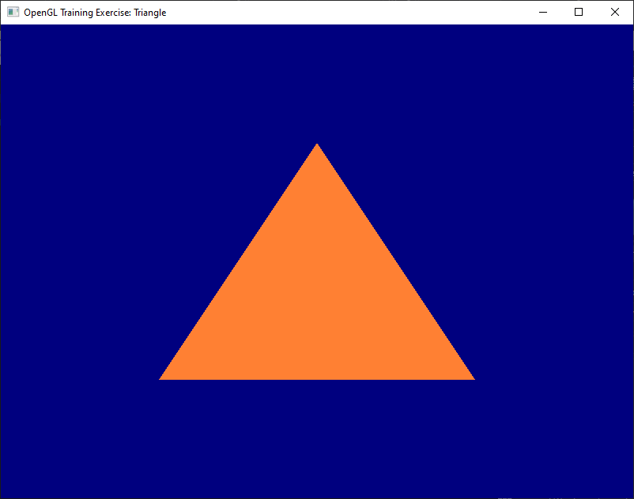
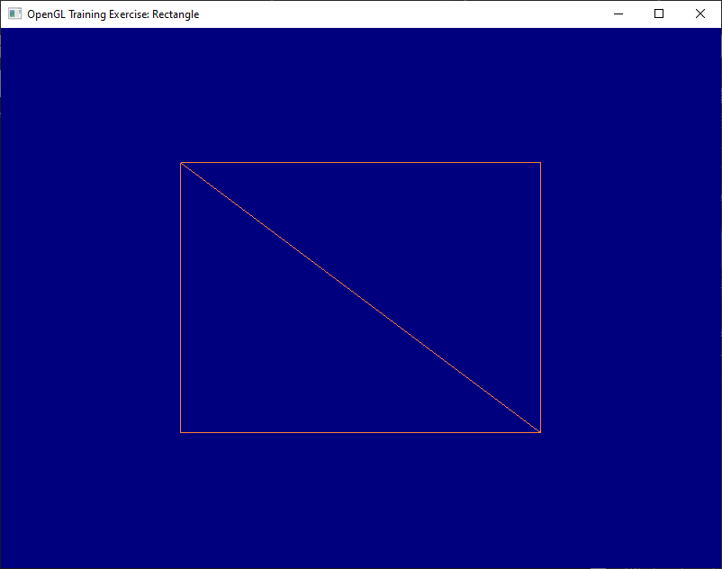
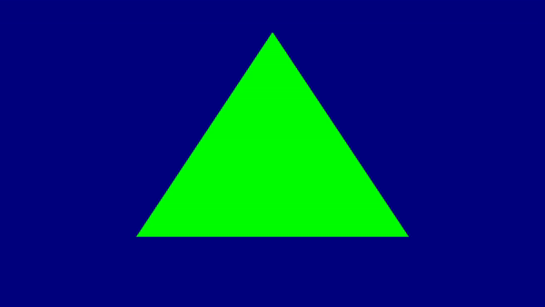
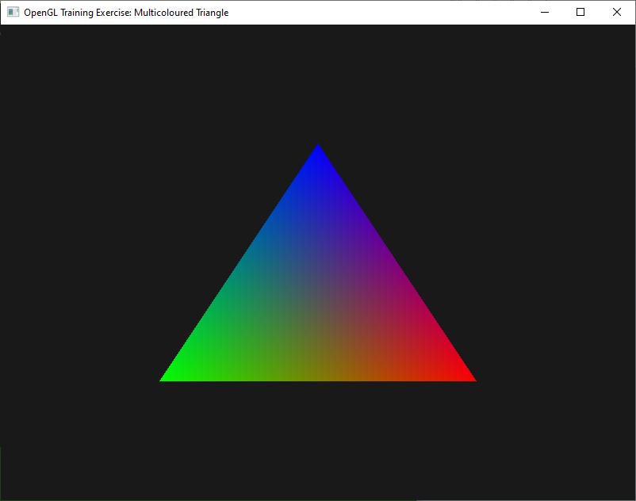

# OpenGL Training

Follows through the tutorials of [Learn OpenGL](https://learnopengl.com/Introduction) by Joey de Vries. It also references the [OpenGL 3.3 Core API Specifications](https://www.khronos.org/registry/OpenGL/specs/gl/glspec33.core.pdf), [GLSL 330 Specifications](https://www.khronos.org/registry/OpenGL/specs/gl/GLSLangSpec.3.30.pdf) and [Khronos' OpenGL wiki](https://www.khronos.org/opengl/wiki/) with [GLSL](https://www.khronos.org/opengl/wiki/OpenGL_Shading_Language). Unlike the linked tutorial, the underlying abstraction layer however, is Simple DirectMedia Layer (SDL) instead of GLFW, and the OpenGL loading library is GLEW instead of GLAD. A simple console menu is used to select the projects associated with each tutorial as a central hub.

## Gallery

