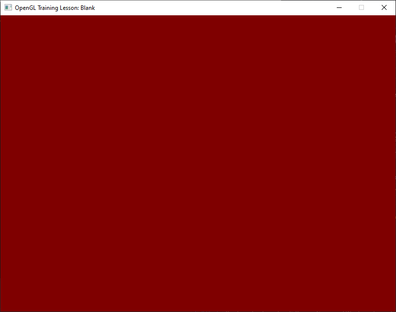

# OpenGL Training

Follows through the tutorials of [Learn OpenGL](https://learnopengl.com/Introduction) by Joey de Vries. The underlying abstraction layer however, is Simple DirectMedia Layer (SDL) instead of GLFW. A simple console menu is used to select the projects associated with each tutorial as a central hub.

## Gallery

